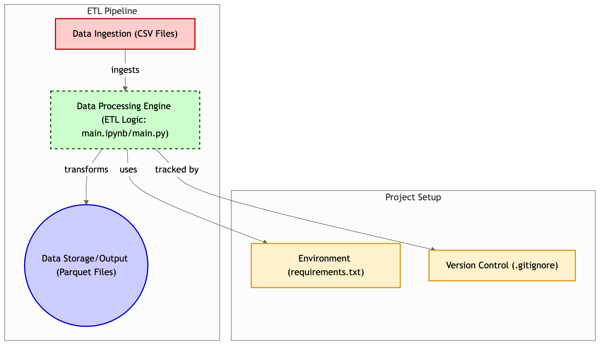

# Revenue Analysis

Revenue analysis

## 🛠️ Setup Instructions

Follow these steps to set up the project on your local machine:

### 1. Create Virtual Environment

Make sure Python (3.8 or later) is installed.

```bash
python3 -m venv .venv
```

### 2. Activate the Environment

```bash
source .venv/bin/activate
```

### 3. Install Dependencies

```python3
pip install -r requirements.txt
```

### 4. Running the project

```python3
python3 main.py
```

## 📁 Project Structure


